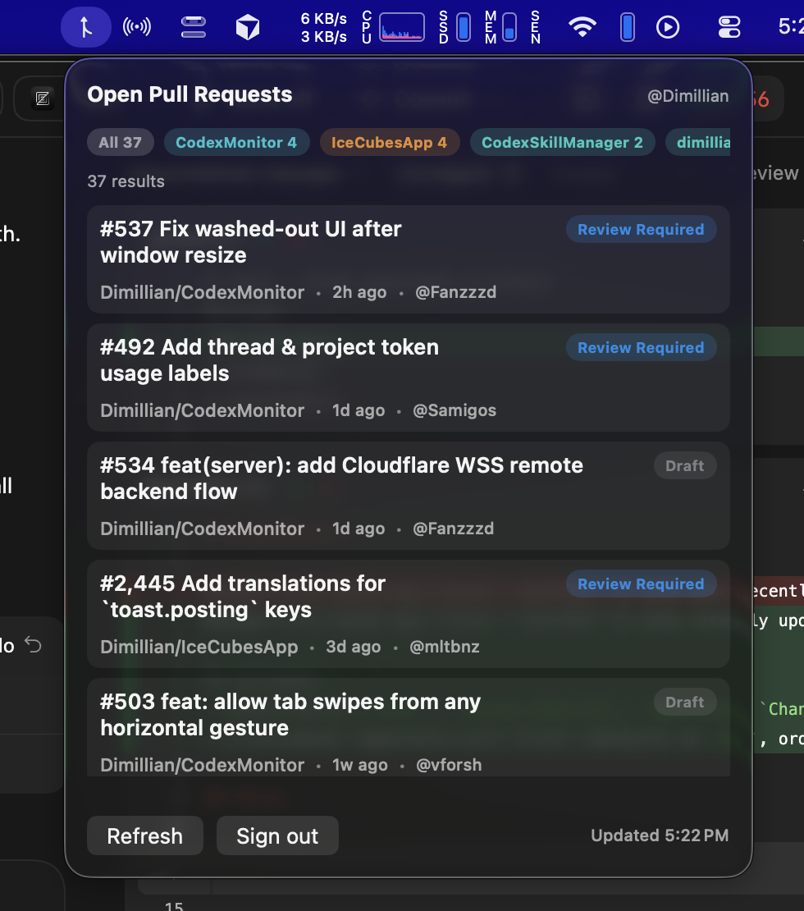

# GithubMonitor

Menubar-only macOS app (Tuist + SwiftUI) to show recently updated open GitHub pull requests across repositories you own or collaborate on.

It includes:
- status pills (`Draft`, `Review Required`, `Approved`, `Changes Requested`)
- a horizontal repository pill filter (defaults to `All`, ordered by most recently updated repo)

## Setup

1. Install Tuist if needed.
2. Add your OAuth client ID in `Project.swift`:
   - `GitHubOAuthClientID` in `infoPlist`, replacing `__GITHUB_CLIENT_ID__`
3. Generate and build:

```bash
TUIST_SKIP_UPDATE_CHECK=1 tuist generate --no-open
TUIST_SKIP_UPDATE_CHECK=1 tuist xcodebuild build -scheme GithubMonitor -workspace GithubMonitor.xcworkspace -configuration Debug -destination "platform=macOS,arch=arm64"
```

4. Run:

```bash
./run-menubar.sh
```

## Login Flow

- Uses GitHub OAuth Device Flow.
- The app opens `https://github.com/login/device` and displays a one-time code.
- Access token is stored in macOS Keychain.
- `Sign out` removes the saved token.

## Scripts

- `run-menubar.sh`: stop existing process, build, and launch app.
- `stop-menubar.sh`: stop running app process.
